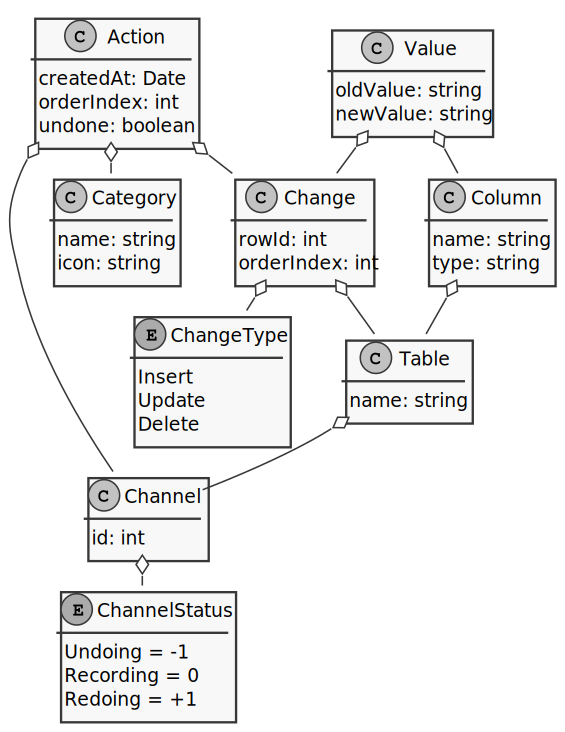
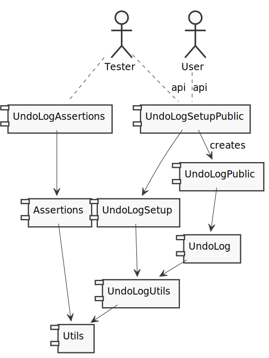

# sqlite-undo-log

[](https://sonarcloud.io/summary/new_code?id=Lotes_sqlite-undo-log)
[](https://sonarcloud.io/summary/new_code?id=Lotes_sqlite-undo-log)
[](https://sonarcloud.io/summary/new_code?id=Lotes_sqlite-undo-log)
[](https://sonarcloud.io/summary/new_code?id=Lotes_sqlite-undo-log)

[](https://sonarcloud.io/summary/new_code?id=Lotes_sqlite-undo-log)
[](https://sonarcloud.io/summary/new_code?id=Lotes_sqlite-undo-log)
[](https://sonarcloud.io/summary/new_code?id=Lotes_sqlite-undo-log)

[](https://sonarcloud.io/summary/new_code?id=Lotes_sqlite-undo-log)
[](https://sonarcloud.io/summary/new_code?id=Lotes_sqlite-undo-log)
[](https://sonarcloud.io/summary/new_code?id=Lotes_sqlite-undo-log)

An undo log for SQLite 3

## Example

First, get all needed concepts...

```typescript
const database = new DatabaseImpl(":memory:");
const connection = await database.connect();
const utils = new UndoLogUtilsImpl(connection);
const setup = new UndoLogSetupImpl(connection, utils);
const log = new UndoLogImpl(connection, utils);
```

Then, setup your database, including tables. Each undoable table must be registered at a channel. A channel manages the status (ready, recording, undoing) and is only a number.

```typescript
await setup.install(); //creates needed tables and triggers
await setup.addTable("my_own_table", 0); //0 = channel name
```

Last, but not least: Record your actions and undo them if required.

```typescript
await log.recordWithin(0, undefined, async () => {
  // <-- record all your INSERT, DELETE & UPDATE statements
});

await log.undo(0 /*channel name*/ );
```

## Installed table schema


## File dependencies


## Plans
* [ ] add adapters for other SQLite implementations
  * [ ] [sqlite](https://www.npmjs.com/package/sqlite)
  * [ ] [sqlite3](https://github.com/TryGhost/node-sqlite3)
  * [ ] [better-sqlite3](https://github.com/WiseLibs/better-sqlite3)
* [ ] add user-friendly API
  * [ ] get back deltas, changed entity ids
  * [ ] a own type system
  * [ ] add redo support
    * [ ] Respect undone flag
* [ ] Complex test scenarios
    * [ ] Foreign keys
    * [ ] Triggers
    * [ ] Order relevant
    * [ ] Composite keys
    * [ ] Multiple undos and redos
